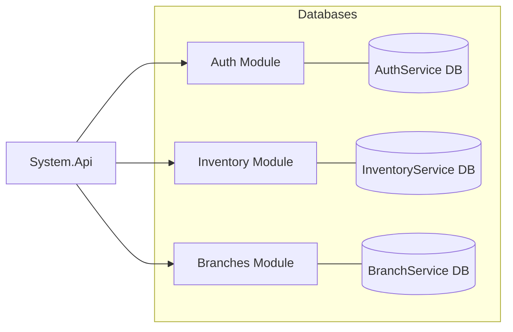

# DriveCore.System 🚀

A robust **Modular Monolith BACKEND** built with **.NET 8** and **PostgreSQL**, following the **Driven Core System** architecture. This project manages Authentication, Inventory, and Branch infrastructure with a strictly decoupled data approach.

## 🏗️ Architecture: Driven Core
Each module is structured to ensure high maintainability and testability:
* **Data:** Entity Framework Core persistence and PostgreSQL configurations.
* **UseCases:** Pure business logic and application flows.
* **Infrastructure:** Implementations for SMTP, Google OAuth, and external services.
* **Contracts:** DTOs and interfaces for cross-module communication.
* **Shared:** A single transversal project containing the `Result<T>` pattern and global utilities.

## 🔐 Authentication Policy
* **Internal Mode (PublicAuthentication: false):** Self-registration is restricted. Access is granted only when an Administrator creates an account via the internal management modules.
* **Open Mode (PublicAuthentication: true):** Enables self-service signup with mandatory SMTP email verification before the account becomes active.

## 📊 Database Architecture
Each module manages its own independent schema within PostgreSQL to prevent tight coupling.


## 🛠️ Setup & Installation

Follow these steps to get your development environment running.

### 1. Prerequisites
* **.NET 8 SDK**
* **PostgreSQL** (Ensure the service is running)
* **EF Core Tools:** ```bash
  dotnet tool install --global dotnet-ef
## 2. Configuration

The project uses an example configuration file. You must create your local settings:

1. Locate `appsettings.Example.json` in `src/System.Api`.
2. Duplicate it and rename the copy to `appsettings.json`.
3. Update the connection strings with your PostgreSQL credentials:

```json
"ConnectionStrings": {
  "AuthConnection": "Server=localhost,5432;Database=AuthService;User Id=postgres;Password=your_password;",
  "BranchConnection": "Server=localhost,5432;Database=BranchService;User Id=postgres;Password=your_password;",
  "InventoryConnection": "Server=localhost,5432;Database=InventoryService;User Id=postgres;Password=your_password;"
}

```
## 3. Database Initialization

This project uses three independent databases. You must apply migrations for each context separately from the root directory:

```bash
# Update Auth Database (Identity, Roles, Menus)
dotnet ef database update --context AuthDbContext --project src/modules/auth/Auth.Data --startup-project src/System.Api

# Update Branches Database (Physical Locations)
dotnet ef database update --context BranchDbContext --project src/modules/branches/Branches.module --startup-project src/System.Api

# Update Inventory Database (Products, Stock, POS)
dotnet ef database update --context InvDbContext --project src/modules/inventory/Inventory.Data --startup-project src/System.Api
```

## 4. Run the Project

Once the configuration and database setup are complete, you can run the project using the following commands:

```bash
dotnet restore
dotnet run --project src/System.Api
```
## 🛠️ Design Patterns

### Result Pattern

We use a custom `Result<T>` instead of throwing exceptions for business logic failures.

- **IsSuccess**: Boolean flag indicating if the operation was successful.  
- **Error**: Object containing:
  - `Code` (e.g., `"NOT_FOUND"`)
  - `Message` (description of the error)

---

### Global Response Handling

The API utilizes the `ToValueOrProblemDetails()` extension to automatically map results to appropriate HTTP status codes:

```csharp
// UseCase execution in Controller
return await useCases.CreateStockTransfer
    .Execute(dto)
    .ToValueOrProblemDetails();
```
### Module Communication (Contracts-Based Architecture)

Communication between modules is handled through interfaces to maintain loose coupling.

- If a service or use case from another module is required, the dependency is defined in a **Contracts project**.
- The Contracts project exposes only interfaces (no implementations).
- Each module implements its own logic while depending only on abstractions.

This approach ensures:
- Clear separation of concerns  
- Low coupling between modules  
- Easier testing and maintainability  

> **Note:**  
> Modules should never directly reference other module implementations—only their contracts.
